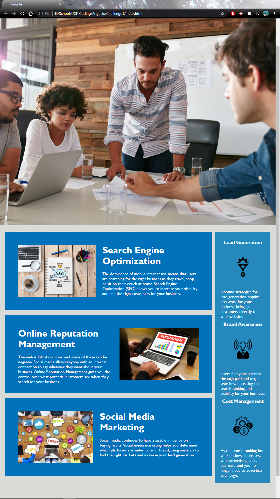

# Challenge1

## Module 1 Challenge:

SEO optimaization for HTML and CSS file.

### Aceptance Criteria

GIVEN a webpage meets accessibility standards
WHEN I view the source code
THEN I find semantic HTML elements
WHEN I view the structure of the HTML elements
THEN I find that the elements follow a logical structure independent of styling and positioning
WHEN I view the image elements
THEN I find accessible alt attributes
WHEN I view the heading attributes
THEN they fall in sequential order
WHEN I view the title element
THEN I find a concise, descriptive title

I went threw the HTML and CSS side by side and renamed certain classes as to eleminate excess code. Items in sections that shared identical CSS values were combined.
I noticed the missing ID for the first portion on the nav bar so I added that in.
I also removed the excess use of Div's as well as changed the main body to articles. I read in module 1 that screen readers have a better time reading articles because it groups the related text into one portion to then pass onto the user.

Changes made by: Corey Boensch
